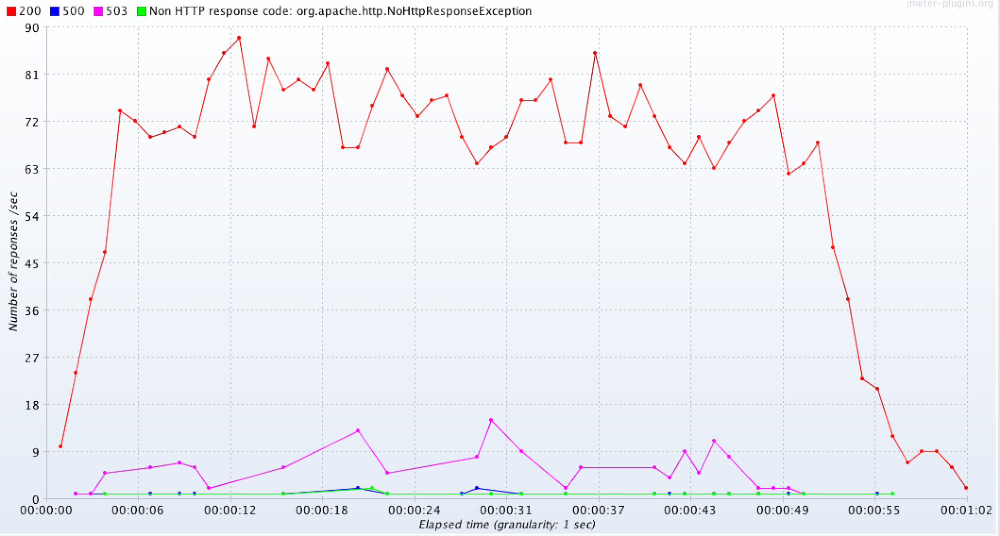
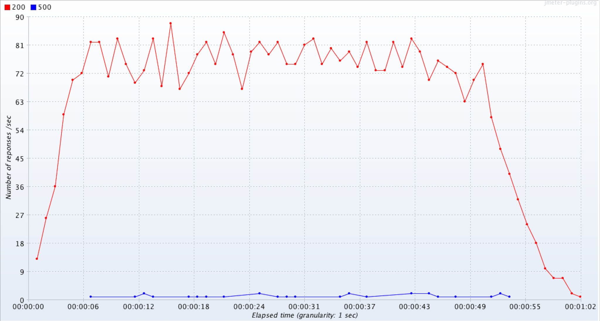

### NGINX and Node composed

This is an example of NGINX composed together with two node processes.

- The node server is set to fail 2% (random number, so results vary) of the time and shut down.
- The NGINX server will retry the next upstream when it gets a 502 or 503.
- Docker restarts processes that die.

This results in very high availability for the deployment.

*Node cluster with automatic restart of child*

*NGINX load balancing and docker automatic restart of process*

